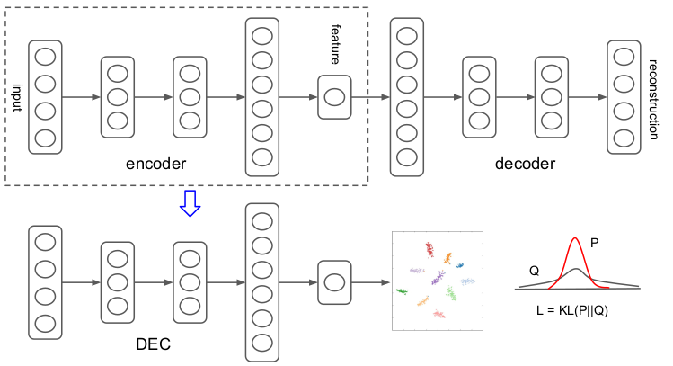

# Deep Embedded Clustering
PyTorch implementation of the Deep Embedded Clustering (DEC) algorithm proposed by [Xie et al.](https://arxiv.org/abs/1511.06335)




## Introduction
Deep Embedding Clustering Algorithm learns a mapping from the data space to a lower-dimensional feature space in which it iteratively optimizes a clustering objective. They define a centroid-based probability distribution and minimize its KL divergence to an auxiliary target distribution to simultaneously improve clustering assignment and feature representation. This algorithm clusters data by simultaneously learning a set of k cluster centers $\{\mu_j\in Z\}_{j=1}^k$ in the feature space Z and the parameters $\theta$ of the DNN that maps data points into Z.

## Requirements
- [numpy](http://www.numpy.org/)
- [torch](https://pytorch.org/)
- [torchvision](https://pypi.org/project/torchvision/)
- [pandas](https://pypi.org/project/pandas/)
- [scipy](https://pypi.org/project/scipy/)
- [scikit-learn](https://pypi.org/project/scikit-learn/)
- [setuptools](https://pypi.org/project/setuptools/)
- [tqdm](https://pypi.org/project/tqdm/)
- [seaborn](https://pypi.org/project/seaborn/)
- [cytoolz](https://pypi.org/project/cytoolz/)

## Project Structure

```
.
├─ models/
│  ├─ clustering.py         <- Soft clustering Assignmenet
│  └─ model.py              <- build Deep Embedded Clustering (DEC) model 
│
├─ sdae/                
│  ├─ dae.py                <- Denoising Auto-Enconder (DAE)
│  ├─ sdae.py               <- Stacked DAE
│  └─ model.py              <- Pre-training and training modules for SDAE
│
├─ utils.py                 <- Utility functions and classes
├─ mnist.py                 <- MNIST class 
├─ eval.py                  <- Evaluation function
├─ train.py                 <- training function
├─ main.py                  <- main file
├─ architecture.png          
└─ README.md
```


## Usage
As mentioned in the paper, to proof the concept, we used a simple common dataset: "MNIST" dataset.
To train and evaluate DEC model on this dataset, set up your configuration (parameters) and run the script as follows:

```
python3 main.py [--data_location DATA_LOCATION]
                [--batch_size BATCH_SIZE] [--num_workers NUM_WORKERS] [--cuda CUDA] 
                [--epochs EPOCHS] [--pretrained_epochs PRETRAINED_EPOCHS] [--lr LR]
```


## Acknowledgments
Thanks to DEC implementation by [Vladimir Lukiyanov](https://github.com/vlukiyanov/pt-dec) and also his implementation of Stacked Denoising Auto-encoders ([SDAE](https://github.com/vlukiyanov/pt-sdae)).
