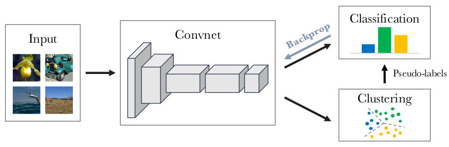

# Deep Clustering for Unsupervised Learning of Visual Features
Pytorch implementation of DeepCluster Algorithm proposed by [Caron et al.](https://arxiv.org/abs/1807.05520).



## Introduction
DeepCluster is a clustering method that jointly learns the parameters of a neural network and the cluster assignments of the resulting features.
First, the input data is fed into a ConvNet architecture and then the output is clustered where we use the subsequent cluster assignments as “pseudo-labels” to optimize the common supervised loss. And then, k-means takes the features produced by the ConvNet as input, and clusters them into k distinct groups based on a geometric criterion. This algorithm alternates between clustering the features to produce pseudo-labels and updating the parameters of the ConvNet architecture by predicting these pseudo-labels.
	

## Requirements
- [numpy](http://www.numpy.org/)
- [torch](https://pytorch.org/)
- [torchvision](https://pypi.org/project/torchvision/)
- [scipy](https://pypi.org/project/scipy/)
- [scikit-learn](https://pypi.org/project/scikit-learn/)
- [Faiss](https://github.com/facebookresearch/faiss)


## Project Structure

```
.
├─ models/
│  ├─ alexnet.py                   <- AlexNet architecture
│  └─ vgg16.py                     <- VGG16 architecture
│
├─ linear_classifier/                
│  ├─ eval.py                      <- Evaluation function
│  ├─ train.py                     <- train function
│  └─ regression.py                <- logistic function
│
├─ classification/                
│  ├─ eval.py                      <- Evaluation function
│  ├─ train.py                     <- train function
│  └─ voc_dataset.py               <- Pascal VOC 2007 dataset class
│
├─ clustering.py                   <- Clustering functions 
├─ utils.py                        <- Utility functions and classes
├─ helpers.py                      <- helper functions: loading models, samplers
├─ visualize.py                    <- Visualization by gradient ascent
├─ train.py                        <- training function of DeepCluster
├─ main.py                         <- main file to train DeepCluster
├─ main_classification.py          <- Classification on VOC dataset
├─ main_linear_classifier.py       <- Eval with linear classifier on the top of AlexNet or VGG16
├─ architecture.png          
└─ README.md
```


## Usage
First, you need to download the ImageNet dataset. You can simply run the script `tinyimagenet.sh`.

To train DeepCluster model on Tiny-ImageNet dataset, set up your configuration (parameters) and run the script as follows:

```
python3 main.py
```


## Evaluation
Here, as the authors mentioned, we provide two evaluation protocols:
* Pascal VOC classification
* Linear classification on activations

Finally, this code also includes a visualisation module that allows to assess visually the quality of the learned features using a gradient ascent algorithm (see `visualize.py` file).


## Acknowledgment
This repo relies mainly on this code [here](https://github.com/facebookresearch/DeeperCluster).
