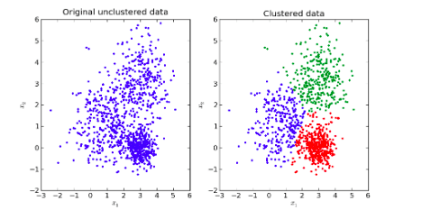

# Self-Supervised-Deep-Clustering
Pytorch implementation of several self-supervised Deep clustering algorithms.



## Introduction
Deep clustering is a new research direction that combines deep learning and clustering. It performs feature representation and cluster assignments simultaneously, and its clustering performance is significantly superior to traditional clustering algorithms. 

## Project Structure

```
.
├─ DEC/                      <- Deep Embeddings Clustering
│  └─ ...
│
├─ DCEC/                     <- Deep Convolutional Embeddings Clustering
│  └─ ...
│
├─ DeepCluster/              <- Deep Clustering Algorithm
│  └─ ...
│
├─ metrics.py                <- Implementation of the three common metrics   
├─ figure.png                <- Clustering problem
└─ README.md
```

## Evaluation
In deep clustering literature, there are three common evaluation metrics as follows:
1. Unsupervised Clustering Accuracy (ACC)
ACC is the unsupervised equivalent of classification accuracy. ACC differs from the usual accuracy metric such that it uses a mapping function m
to find the best mapping between the cluster assignment output c of the algorithm with the ground truth y. This mapping is required because an unsupervised algorithm may use a different label than the actual ground truth label to represent the same cluster. 

\[ ACC = max_m\frac{\sum_{i=1}^{n}1_{\{y_i=m(c_i)\}}}{n} \]


2. Normalized Mutual Information (NMI)
NMI is an information theoretic metric that measures the mutual information between the cluster assignments and the ground truth labels. It is normalized by the average of entropy of both ground labels and the cluster assignments.
\[NMI(Y,C) = \frac{I(Y,C)}{0.5(H(Y)+H(C))}\]

3. Adjusted Rand Index (ARI)
The Rand Index computes a similarity measure between two clusterings by considering all pairs of samples and counting pairs that are assigned in the same or different clusters in the predicted and true clusterings. The adjusted Rand index is the corrected-for-chance version of the Rand index.


## References
1. [Unsupervised Deep Embedding for Clustering Analysis](https://arxiv.org/abs/1511.06335)
2. [Deep Clustering with Convolutional Autoencoders](https://xifengguo.github.io/papers/ICONIP17-DCEC.pdf)
3. [Deep Clustering for Unsupervised Learning of Visual Features](https://arxiv.org/abs/1807.05520)
